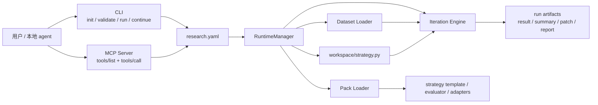

# `autoresearch-agent`

一个本地可安装的 `research agent runtime`。  
它的目标不是做一个大而全的平台，而是给你一条清晰、可控、可被 `agent` 调用的研究链路：

- 你提供数据
- 你定义研究目标和约束
- 它在受控文件上做迭代搜索
- 它产出结果、策略文件、补丁和报告
- 它既可以用 `CLI` 跑，也可以暴露成标准 `MCP` 给别的 `agent` 调用

当前仓库只保留一条主链路：

- 唯一运行时：`src/autoresearch_agent`
- 唯一官方示例：`examples/prediction-market`
- 唯一对外能力面：本地 `CLI` + 标准 `MCP` over `stdio`

## 这个项目适合什么场景

这个项目适合下面这类需求：

- 你想在本地做一套“自动研究”流程，而不是手工反复改策略
- 你已经有自己的数据，希望让 `agent` 帮你迭代策略参数或提示逻辑
- 你希望研究过程可复现，有明确的输入、约束、产物和运行目录
- 你想把研究能力暴露成 `MCP`，让 `Codex`、其他本地 `agent` 或自建客户端来调用

当前仓库内置的第一个领域包是预测市场：

- `prediction_market`

但运行时本身并不只服务预测市场。它的设计是：

- `runtime` 负责跑研究
- `pack` 负责定义领域逻辑
- `project` 负责承载你的数据、策略文件和配置

## 先理解这 4 个核心概念

### 1. `project`

一个本地研究项目目录。里面至少有：

- `research.yaml`
- `datasets/`
- `workspace/strategy.py`
- `.autoresearch/`

### 2. `pack`

一个领域插件。它定义：

- 支持的数据格式
- 允许搜索的轴
- 默认策略模板
- 领域评估逻辑

当前内置的是：

- `prediction_market`

### 3. `editable target`

运行时不会在整个项目里随意改代码。  
它只围绕 `research.yaml` 里的这个字段工作：

- `search.editable_targets[0]`

默认就是：

- `workspace/strategy.py`

### 4. `artifact`

每次运行都会落一组可检查的产物，例如：

- `result.json`
- `summary.json`
- `best_strategy.py`
- `strategy.patch`
- `report.md`

## 项目架构

### 总体架构图



### 代码分层

可以把仓库理解成这 5 层：

1. `examples/prediction-market`
   官方示例项目，给你一个可以直接跑通的最小样本。

2. `src/autoresearch_agent/cli`
   本地命令入口，负责 `init`、`validate`、`run`、`status`、`artifacts` 等命令。

3. `src/autoresearch_agent/mcp`
   标准 `MCP` 服务层，把运行时暴露成可被外部 `agent` 调用的工具。

4. `src/autoresearch_agent/core`
   核心运行时，包括配置加载、数据加载、策略加载、搜索迭代、产物写出和运行状态管理。

5. `src/autoresearch_agent/packs`
   领域包层。当前的预测市场包就在这里。

### 目录结构

```text
src/autoresearch_agent/
  cli/                  # 本地命令入口
  core/
    datasets/           # 数据加载与数据摘要
    packs/              # pack 发现与项目脚手架
    runtime/            # 运行管理、状态、产物
    search/             # 迭代引擎
    spec/               # research.yaml 规范
  mcp/                  # 标准 MCP server
  packs/
    prediction_market/  # 预测市场 pack
  project/              # 初始化项目脚手架

examples/prediction-market/
  research.yaml
  datasets/eval_markets.json
  workspace/strategy.py
```

## 它是怎么工作的

一次标准运行的逻辑，可以理解成下面 7 步：

1. 读取 `research.yaml`
2. 加载 `pack`，确认允许搜索哪些轴
3. 加载 `data.source` 指向的数据文件
4. 加载 `search.editable_targets[0]` 对应的策略文件
5. 从策略常量提取初始配置，交给 `Iteration Engine` 做多轮搜索
6. 选出最佳配置，并生成 `best_strategy.py` 和 `strategy.patch`
7. 把结果、摘要、报告和产物索引写到 run 目录

对应到当前实现里：

- `CLI` 和 `MCP` 都只是入口层
- 真正执行研究的是 `RuntimeManager`
- `Iteration Engine` 负责搜索配置空间
- `pack` 提供领域默认值和模板
- `artifact` 层负责把结果变成可读、可检查、可继续迭代的输出

## `research.yaml` 负责什么

`research.yaml` 是整个项目的中心配置。

最值得理解的是这几个部分：

- `project`
  定义项目名、`runs_dir`、`artifacts_dir`
- `pack`
  选择要使用的领域包
- `data`
  定义数据源、格式、采样和切分
- `search`
  定义可编辑目标、允许搜索的轴、最大迭代次数
- `evaluation`
  定义评估和 gate 配置
- `runtime`
  定义模型提供方、模型名和环境变量引用
- `outputs`
  定义是否写出 `patch`、`report`、`best_strategy`、数据摘要

一句话理解：

- `research.yaml` 决定“研究什么、用什么数据、能改什么、最多跑多久、最终写出什么”

## 3 分钟上手

### 开始前你需要准备什么

如果你是第一次使用，建议先准备这 4 类东西：

1. 本地运行环境

- `Python 3.11+`
- 一个可用的虚拟环境

2. 模型访问配置

当前示例默认走：

- `runtime.provider = openai`
- `runtime.model = gpt-5.4`

因此你至少需要准备：

- `OPENAI_API_KEY`

如果你使用兼容接口，也可以额外准备：

- `OPENAI_BASE_URL`

3. 一个研究项目目录

最简单的方式不是手写目录，而是直接用：

- `python -m autoresearch_agent init ...`

它会帮你生成：

- `research.yaml`
- `datasets/`
- `workspace/strategy.py`
- `.autoresearch/`

4. 一份可被当前 `pack` 读取的数据文件

对当前预测市场 `pack` 来说，最推荐先准备：

- 一个标准化的 `json` 文件

当前也支持：

- `csv`

但如果你只是第一次接入，建议优先用 `json`，因为最容易校验和排错。

### 1. 安装

从源码安装：

```bash
pip install -e .
```

如果你需要测试依赖：

```bash
pip install -e ".[dev]"
```

### 2. 用示例数据初始化一个项目

仓库自带一个最小预测市场样本：

```text
examples/prediction-market/datasets/eval_markets.json
```

运行：

```bash
python -m autoresearch_agent init ./demo-project --pack prediction_market --data-source ./examples/prediction-market/datasets/eval_markets.json
```

生成的项目结构大致是：

```text
demo-project/
  research.yaml
  datasets/
  workspace/
    strategy.py
  artifacts/
  .autoresearch/
```

### 3. 校验项目

```bash
python -m autoresearch_agent validate ./demo-project
```

这一步会检查：

- `research.yaml` 是否合法
- `pack` 是否存在
- 数据是否能读
- `workspace/strategy.py` 是否能加载

### 4. 运行一轮研究

```bash
python -m autoresearch_agent run ./demo-project
```

### 5. 查看状态和产物

```bash
python -m autoresearch_agent status <run_id> --project-root ./demo-project
python -m autoresearch_agent artifacts <run_id> --project-root ./demo-project
```

### 6. 继续迭代

```bash
python -m autoresearch_agent continue <run_id> --project-root ./demo-project
```

## 一次运行会输出什么

每次运行都会在：

- `.autoresearch/runs/<run_id>/`

下面写出核心结果文件：

- `result.json`
- `summary.json`
- `run_manifest.json`
- `run_spec.json`

默认还会在 run 内的 `artifacts/` 子目录写出：

- `iteration_history.json`
- `artifact_index.json`
- `best_strategy.py`
- `strategy.patch`
- `report.md`
- `dataset_profile.json`
- `dataset_snapshot.json`

其中最值得看的通常是：

- `result.json`
  最终最佳结果
- `summary.json`
  项目、数据摘要和最佳结果汇总
- `best_strategy.py`
  当前这轮研究推荐的策略文件
- `strategy.patch`
  相对于原始策略文件的差异
- `report.md`
  面向人快速阅读的摘要

## 如何让自己的 agent 调用

如果你想把这个研究项目暴露给别的 `agent`，启动标准 `MCP` 服务即可：

```bash
python -m autoresearch_agent mcp serve --project-root ./demo-project
```

当前暴露的工具有：

- `ping`
- `list_packs`
- `validate_project`
- `run_project`
- `continue_run`
- `cancel_run`
- `stop_run`
- `get_run_status`
- `list_artifacts`
- `read_artifact`

### 客户端最小配置示意

如果你的客户端支持标准 `MCP` `stdio`，最小配置通常长这样：

```json
{
  "command": "/absolute/path/to/.venv/bin/python",
  "args": [
    "-m",
    "autoresearch_agent",
    "mcp",
    "serve",
    "--project-root",
    "/absolute/path/to/demo-project"
  ]
}
```

调用方需要保证两件事：

- `command` 指向的 Python 环境里已经安装了 `autoresearch-agent`
- `--project-root` 指向的是一个已经 `init` 过、包含 `research.yaml`、并且 `validate` 能通过的项目目录

推荐调用顺序：

1. `initialize`
2. `notifications/initialized`
3. `tools/list`
4. `tools/call(name=validate_project)`
5. `tools/call(name=run_project)`
6. 轮询 `tools/call(name=get_run_status)`
7. 调用 `tools/call(name=list_artifacts)`
8. 需要看内容时调用 `tools/call(name=read_artifact)`

### 调用方最常见的完整流程

一个最常见的调用方流程是：

1. 启动 `MCP` 服务
2. 调用 `initialize`
3. 发送 `notifications/initialized`
4. 调用 `tools/list`，确认工具集可见
5. 调用 `validate_project`
6. 调用 `run_project`
7. 保存返回的 `run_id`
8. 轮询 `get_run_status`，直到状态变成 `finished`
9. 调用 `list_artifacts`
10. 用 `read_artifact` 读取 `result.json`、`report.md`、`best_strategy.py` 或 `strategy.patch`

`run_project` 和 `continue_run` 不会同步阻塞到任务结束。  
它们会先返回 `run_id`，服务端把任务状态持久化到：

```text
<project>/.autoresearch/state/mcp_jobs/
```

这样客户端可以断开后重连，再继续轮询、取消或强停。

### 调用方常见错误

如果客户端接不上，优先检查：

- 是否先发了 `initialize`，再发 `notifications/initialized`
- Python 环境里是否真的安装了 `autoresearch-agent`
- `--project-root` 是否写成了仓库根目录，而不是你的项目目录
- 项目是否先跑过 `validate`
- 是否误把 `run_project` 当成同步接口直接等待结果，而没有轮询 `get_run_status`
- `tools/call` 的 `arguments` 是否真的是一个对象
- 是否在运行未完成时就直接读 `artifact`

如果运行已经提交但你想中止：

- 优先调用 `cancel_run`
- 需要更强中止时调用 `stop_run`

## 典型使用方式

你可以把它当成 3 种东西来使用：

### 1. 本地研究命令行

适合个人研究、调参、快速验证数据和策略。

### 2. 可复现的研究项目模板

适合团队内共享研究流程，让每个人都在同样的目录结构、配置约束和产物契约下工作。

### 3. 本地 `MCP` 能力服务

适合让别的 `agent` 直接调用你的研究项目，而不是靠手工复制命令。

## 当前示例到底在做什么

当前内置示例是一个最小预测市场研究项目：

- 数据：`examples/prediction-market/datasets/eval_markets.json`
- 可编辑文件：`workspace/strategy.py`
- 默认搜索轴：
  - `confidence_threshold`
  - `bet_sizing`
  - `max_bet_fraction`
  - `prompt_factors`

也就是说，这个示例不是一个“黑箱模型训练器”，而是一个：

- 读取预测市场样本
- 在受控策略文件上做参数和提示因子搜索
- 输出最佳配置与可读产物

的本地自动研究样本。

## 如果你想换成自己的数据

你不需要改运行时，只需要：

1. 把数据放进项目目录
2. 在 `research.yaml` 里把 `data.source` 指向你的文件
3. 视情况调整 `data.format`、`adapter`、`search.allowed_axes`
4. 修改 `workspace/strategy.py`，让它表达你的策略逻辑

如果以后你想支持一个新的研究领域，再新增一个 `pack` 即可。

### 普通用户第一次接入自己数据的完整示例

如果你是第一次接自己的数据，推荐按下面这条最稳的路径来：

#### 第 1 步：初始化一个空项目

```bash
python -m autoresearch_agent init ./my-first-project --pack prediction_market --data-source ./datasets/my_markets.json
```

初始化后你会得到：

```text
my-first-project/
  research.yaml
  datasets/
  workspace/
    strategy.py
  artifacts/
  .autoresearch/
```

#### 第 2 步：把你的数据文件放进去

最简单的做法是把自己的数据放到：

```text
my-first-project/datasets/my_markets.json
```

#### 第 3 步：把 `research.yaml` 指向你的数据

一个最小可跑的配置可以长这样：

```yaml
pack:
  id: prediction_market

data:
  source: ./datasets/my_markets.json
  format: json
  adapter: canonical_json

search:
  editable_targets:
    - workspace/strategy.py
  allowed_axes:
    - confidence_threshold
    - bet_sizing
    - max_bet_fraction
    - prompt_factors

runtime:
  provider: openai
  model: gpt-5.4
  env_refs:
    - OPENAI_API_KEY

outputs:
  write_patch: true
  write_report: true
  write_best_strategy: true
  write_dataset_profile: true
```

#### 第 4 步：把数据先整理成推荐的 `json`

第一次接入时，建议每条记录先整理成这种结构：

```json
[
  {
    "market_id": "my-market-001",
    "question": "Will candidate A win?",
    "outcomes": ["Yes", "No"],
    "outcome_prices": [0.43, 0.57],
    "final_resolution": "No",
    "final_resolution_index": 1,
    "last_trade_price": 0.43,
    "volume": 180000.0,
    "context": {
      "category": "Politics",
      "event_title": "Election 2026",
      "liquidity": 25000.0
    }
  }
]
```

你至少要重点保证这些字段是可用的：

- `question`
- `outcomes`
- `final_resolution_index`
- `last_trade_price`
- `volume`

如果你暂时没有非常完整的上下文字段，也可以先不放：

- `context.category`
- `context.event_title`
- `context.liquidity`

#### 第 5 步：先跑校验，再跑研究

```bash
python -m autoresearch_agent validate ./my-first-project
python -m autoresearch_agent run ./my-first-project
```

#### 第 6 步：查看结果

```bash
python -m autoresearch_agent status <run_id> --project-root ./my-first-project
python -m autoresearch_agent artifacts <run_id> --project-root ./my-first-project
```

第一次跑完后，最值得看的通常是：

- `result.json`
- `summary.json`
- `artifacts/best_strategy.py`
- `artifacts/strategy.patch`
- `artifacts/report.md`

### 第一次接入最容易踩的坑

普通用户第一次接数据，最容易出错的是这几类：

1. 文件路径不对

- `data.source` 写成了仓库根目录下的相对路径
- 但你真正运行的是项目目录

2. `format` 和 `adapter` 不匹配

- `json` 文件却写成了 `adapter: polymarket_csv`
- `csv` 文件却写成了 `adapter: canonical_json`

3. 顶层结构不对

- `canonical_json` 要的是记录数组
- 或 `{ "records": [...] }`
- 不是字符串，也不是多层嵌套对象

4. 关键字段缺失

- 缺少 `question`
- 缺少 `outcomes`
- 缺少 `final_resolution_index`
- 缺少 `last_trade_price`
- 缺少 `volume`

5. 还没 `validate` 就直接 `run`

- 最稳妥的流程永远是：
  - `init`
  - `validate`
  - `run`

## 预测市场数据需要整理成什么格式

对当前内置的 `prediction_market` `pack`，实际支持两种输入格式：

- `json`
- `csv`

在 `research.yaml` 里对应的是：

```yaml
data:
  source: ./datasets/eval_markets.json
  format: json
  adapter: canonical_json
```

或者：

```yaml
data:
  source: ./datasets/polymarket.csv
  format: csv
  adapter: polymarket_csv
```

### 推荐格式：`json`

最推荐的是标准化 `json`。  
当前 `canonical_json` 适配器接受两种形态：

```json
[
  { "market_id": "pm-001", "...": "..." }
]
```

或者：

```json
{
  "records": [
    { "market_id": "pm-001", "...": "..." }
  ]
}
```

也就是说，本质上它要求：

- 一个记录数组
- 或一个包含 `records` 数组的对象

### `json` 记录建议至少包含什么

如果你想让预测市场评估逻辑稳定工作，建议每条记录至少有这些字段：

- `market_id`
- `question`
- `outcomes`
- `final_resolution_index`
- `last_trade_price`
- `volume`

更完整、也更接近官方示例的结构通常是：

```json
{
  "market_id": "pm-001",
  "question": "Will X happen?",
  "outcomes": ["Yes", "No"],
  "outcome_prices": [0.41, 0.59],
  "final_resolution": "No",
  "final_resolution_index": 1,
  "last_trade_price": 0.41,
  "volume": 120000.0,
  "context": {
    "category": "Politics",
    "event_title": "US election",
    "liquidity": 25000.0
  }
}
```

字段含义可以这样理解：

- `question`
  市场问题
- `outcomes`
  候选结果，当前预测市场示例默认按二元市场设计
- `final_resolution_index`
  最终真实结果的下标
- `last_trade_price`
  当前市场隐含概率
- `volume`
  市场成交量，用于采样和数据摘要
- `context`
  可选上下文，用于分类、事件标题、流动性等信息

### `csv` 什么时候用

当前 `csv` 适配器主要是：

- `polymarket_csv`

它更适合你手头已经有类似 `Polymarket` 导出数据的情况。  
这个适配器会从 `csv` 中读取并清洗字段，重点依赖这些列：

- `id`
- `question`
- `outcomes`
- `outcomePrices`
- `lastTradePrice`
- `volumeNum`
- `closed`
- `resolvedBy`

可选但推荐保留的列包括：

- `category`
- `subcategory`
- `event_title`
- `liquidityNum`
- `negRisk`

如果你没有现成的 `Polymarket csv`，更建议先转成标准化 `json` 再接入。

### 第一次接入时的实用建议

如果你想减少排错成本，建议按这个顺序准备数据：

1. 先对照官方示例 `examples/prediction-market/datasets/eval_markets.json`
2. 把自己的数据先整理成 `json`
3. 确保每条记录至少有上面列出的关键字段
4. 在 `research.yaml` 中设置：
   - `data.format: json`
   - `data.adapter: canonical_json`
5. 先运行：
   - `python -m autoresearch_agent validate ./demo-project`
6. 通过后再开始 `run`

如果 `validate` 过不了，优先检查的往往是：

- `data.source` 路径是否正确
- `format` 和 `adapter` 是否匹配
- `json` 顶层是不是数组或 `{ "records": [...] }`
- 每条记录是不是对象，而不是字符串或嵌套数组

## 想深入看哪里

- 架构说明：[docs/runtime-architecture.md](docs/runtime-architecture.md)
- `skill` 契约：[skills/autoresearch-agent/SKILL.md](skills/autoresearch-agent/SKILL.md)
- 发布说明：[docs/pypi-release.md](docs/pypi-release.md)
- 变更记录：[CHANGELOG.md](CHANGELOG.md)
- 贡献指南：[CONTRIBUTING.md](CONTRIBUTING.md)
- 安全策略：[SECURITY.md](SECURITY.md)

## 许可证

本项目使用 `MIT` 许可证。
